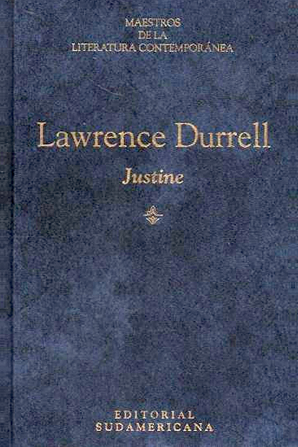

# Lawrence Durrell, Justine

*Sabado 2 de Marzo, 2024*

## Citas

> Las ideas se nos ocurrian simultaneamente. Recuerdo que una vez me di cuenta que ella estaba pensando exactamente lo mismo que yo y en los mismos terminos: "Esta intimidad *no debe ir mas lejos*, pues hemos agotado ya todas sus posibilidades en la imaginacion; y lo que terminaremos por descubrir, mas alla de los sombríos colores de la sensualidad, **es una amistad tan profunda que seremos esclavos uno del otro para siempre**." Era, si se quiere, el coqueteo de dos espíritus prematuramente extenuados por la experiencia, mucho más peligroso que un amor fundado en la atracción sexual. (p. 25)

> El  objeto amado no es sino aquel que ha compartido simultáneamente una experiencia, a la manera de Narciso; y el deseo de estar junto al objeto amado no responde al anhelo de poseerlo, sino **al de que dos experiencias se comparen mutuamente, como imágenes en espejos diferentes**. Todo ello puede preceder a la primera mirada, al primer beso o contacto; precede a la ambición, al orgullo y a la envidia; precede a las primeras declaraciones que marcan el instante de la crisis, porque a partir de allí el amor degenera en costumbre, posesión, y regresa a la soledad. (p. 50)

> Clea interpretará mi silencio según sus propias necesidades y deseos, y vendrá o no vendrá; ella es quien debe decidirlo. **¿Acaso no depende todo de nuestra manera de interpretar el silencio que nos rodea?** (p. 255)