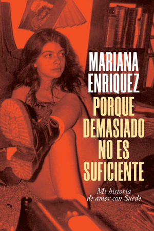

# Porque demasiado no es suficiente

*Miercoles 1 de Mayo, 2024*

## Citas

> Lo que sea que me hiciera feliz un sabado a la noche, una salida compartida con alguien que entendiera lo desangelada y triste que puede ser una vida de oficina, alquien que no dijera pavadas como que hay trabajos peores (por supuesto: y hay guerras y enfermedades terminales), alguien capaz de pensar que, a pesar de ese trabajo que tritura el espiritu, la ciudad, algunas noches, especialmente las del sabado, puede ser un lugar donde jugar, donde el lapiz labial retocado con obsesion no se corre, donde las canciones siempre suenan como el futuro. Las noches de sábado, cuando las chicas que se pasaron la semana con la espalda dolorida y el pelo imposible de domar se calzan tacos y anillos y piden un taxi porque pueden darse ese lujo. (p. 132)

> […] le veía en la cara esa expresión de primera vez en América Latina que tienen todos los músicos acá. Por eso me enoja que vengan tan poco. Les damos amor, no dinero. Nuestro amor barato. (p. 133)

> […] es el hallazgo del espíritu después de mucho tiempo, pero uno no se enamora de una cancion sagrada, sino mas bien de un jean viejo que queda bien, de un saco que abriga lo justo, de unos anteojos rayados, pero que ocultan los ojos en la linea deseada. Uno se enamora de una risa y una espalda, no de un discurso. (p. 146)

> Una fan de las intensas, alemana o de algun lugar de Europa del norte que me cae mal por próspero e ignorante, me empujó muy bestia cuando yo intenté robar un lugar en la barrera. La insulté en español. No me entendió las palabras pero sí la intención. Juro por todos los dioses que le hubiese destrozado esa cara de austríaca sin sol con unas ganas y una ferocidad desconocidas, de hecho escribo esto y sigo pensando en su sangre aria en mis manos, en chuparme los dedos rojos y meterselos en la boca a la maleducada hija de remilputas. (p. 174)